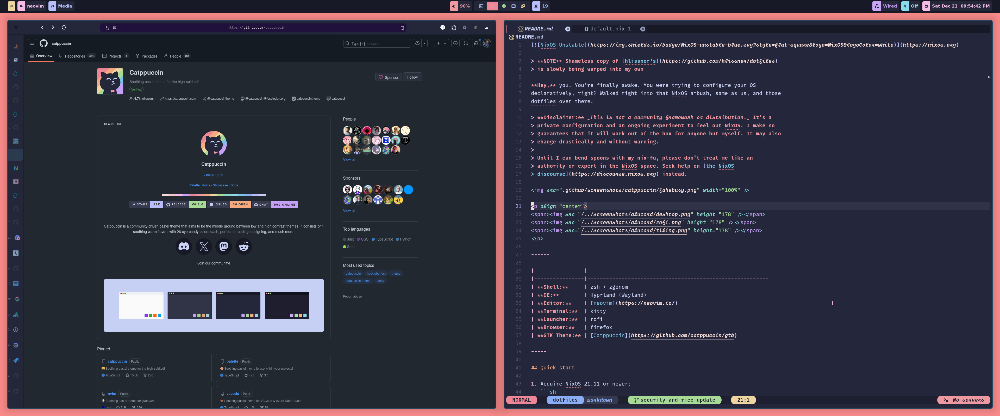

[](https://nixos.org)

> **NOTE** Shameless copy of [hlissner's](https://github.com/hlissner/dotfiles)
> is slowly being warped into my own

**Hey,** you. You're finally awake. You were trying to configure your OS
declaratively, right? Walked right into that NixOS ambush, same as us, and those
dotfiles over there.

> **Disclaimer:** _This is not a community framework or distribution._ It's a
> private configuration and an ongoing experiment to feel out NixOS. I make no
> guarantees that it will work out of the box for anyone but myself. It may also
> change drastically and without warning.
>
> Until I can bend spoons with my nix-fu, please don't treat me like an
> authority or expert in the NixOS space. Seek help on [the NixOS
> discourse](https://discourse.nixos.org) instead.



<!-- <p align="center"> -->
<!-- <span></span> -->
<!-- <span></span> -->
<!-- <span></span> -->
<!-- </p> -->

------

|                |                                                          |
|----------------|----------------------------------------------------------|
| **Shell:**     | zsh + zgenom                                             |
| **DE:**        | Hyprland (Wayland)                                       |
| **Editor:**    | [neovim](https://neovim.io/)                                                 |
| **Terminal:**  | kitty                                                    |
| **Launcher:**  | rofi                                                     |
| **Browser:**   | firefox                                                  |
| **GTK Theme:** | [Catppuccin](https://github.com/catppuccin/gtk)          |

-----

## Quick start

1. Acquire NixOS 21.11 or newer:
   ```sh
   # Yoink nixos-unstable
   wget -O nixos.iso https://channels.nixos.org/nixos-unstable/latest-nixos-minimal-x86_64-linux.iso

   # Write it to a flash drive
   cp nixos.iso /dev/sdX
   ```

2. Boot into the installer.

3. Switch to root user: `sudo su -`

4. Do your partitions and mount your root to `/mnt` ([for
   example](hosts/kuro/README.org)).

5. Install these dotfiles:
   ```sh
   nix-shell -p git nixFlakes

   # Set HOST to the desired hostname of this system
   HOST=...
   # Set USER to your desired username (defaults to hlissner)
   USER=...

   git clone https://github.com/JordanFaust/dotfiles /etc/dotfiles
   git checkout main
   cd /etc/dotfiles

   # Create a host config in `hosts/` and add it to the repo:
   mkdir -p hosts/$HOST
   nixos-generate-config --root /mnt --dir /etc/dotfiles/hosts/$HOST
   rm -f hosts/$HOST/configuration.nix
   vim hosts/$HOST/default.nix  # configure this for your system; don't use it verbatim!
   git add hosts/$HOST

   # Install nixOS
   USER=$USER nixos-install --root /mnt --impure --flake .#$HOST

   # If you get 'unrecognized option: --impure', replace '--impure' with
   # `--option pure-eval no`.

   # Then move the dotfiles to the mounted drive!
   mv /etc/dotfiles /mnt/etc/dotfiles
   ```

6. Then reboot and you're good to go!

> :warning: **Don't forget to change your `root` and `$USER` passwords!** They
> are set to `nixos` by default.

8. Setting Up Firefox

Not everything was setup for my firefox theme via the install. I use the following extensions:

* Tree Style Tab
* Facebook container
* Firefox Multi-Account Containers
* nightTab
* Hacker News Enhancement Suite
* Okta Browser Plugin
* Privacy Badger

Additionally Tree Style Tab must be updated with my specific configuration.

1. Go to preferences and go to Advanced > Extra Styles
2. Copy the content of ./firefox/treestyletab/custom.css and save it
3. Go to Appearance and check "No Decoration"
4. Go to Drag and Drop and set Drag to "Don nothing"

## Management

And I say, `bin/hey`, [what's going on?](http://hemansings.com/)

```
Usage: hey [global-options] [command] [sub-options]

Available Commands:
  check                  Run 'nix flake check' on your dotfiles
  gc                     Garbage collect & optimize nix store
  generations            Explore, manage, diff across generations
  help [SUBCOMMAND]      Show usage information for this script or a subcommand
  rebuild                Rebuild the current system's flake
  repl                   Open a nix-repl with nixpkgs and dotfiles preloaded
  rollback               Roll back to last generation
  search                 Search nixpkgs for a package
  show                   [ARGS...]
  ssh HOST [COMMAND]     Run a bin/hey command on a remote NixOS system
  swap PATH [PATH...]    Recursively swap nix-store symlinks with copies (and back).
  test                   Quickly rebuild, for quick iteration
  theme THEME_NAME       Quickly swap to another theme module
  update [INPUT...]      Update specific flakes or all of them
  upgrade                Update all flakes and rebuild system

Options:
    -d, --dryrun                     Don't change anything; perform dry run
    -D, --debug                      Show trace on nix errors
    -f, --flake URI                  Change target flake to URI
    -h, --help                       Display this help, or help for a specific command
    -i, -A, -q, -e, -p               Forward to nix-env
```

## Security

The following steps can generate an SBOM and analyze the generate a list of packages that currently have unpached CVEs

Generate meta information used during SBOM generation:

```bash
nix-env -qa --meta --json '.*' > reports/meta.json
```

Generate SBOM:

```bash
sbomnix /run/current-system/sw/ --csv ./reports/sbom.csv --cdx ./reports/sbox.cdx.json --spdx ./reports/sbom.spdx.json --meta ./reports/meta.json
```

Scan for vulnerabilities from the generated SBOM:

```bash
grype sbom:./reports/sbom.spdx.json --add-cpes-if-none
```

[doom-emacs]: https://github.com/hlissner/doom-emacs
[nixos]: https://releases.nixos.org/?prefix=nixos/unstable/
[agenix]: https://github.com/ryantm/agenix
